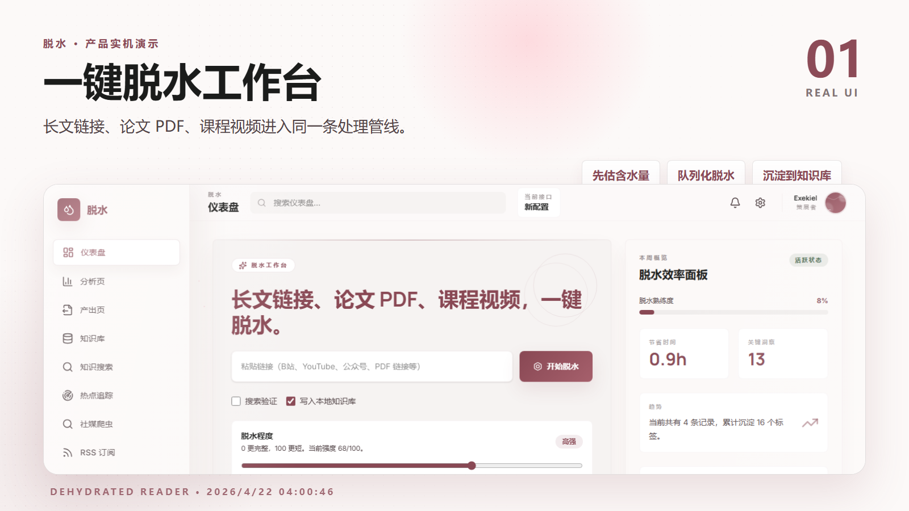

# 脱水 Dehydrated Reader

脱水是一个中文知识处理工作台：把长文链接、论文 PDF、课程视频、RSS、热点和社媒素材压成可回看、可搜索、可再创作的高密度知识卡片。

> 挤掉水分，把注意力还给判断。

## 授权与商业使用

本仓库采用非商用源码共享授权，详见 [LICENSE-NONCOMMERCIAL.md](./LICENSE-NONCOMMERCIAL.md)。

你可以学习、研究、私用、非商用改造；未经作者书面许可，不可以售卖、二次包装成商业软件、SaaS、API 服务、浏览器插件、企业部署或付费交付。

商业授权请联系：exekiel179179@gmail.com

## 项目截图

商品介绍图位于：

- `marketing/product-intro/index.html`
- `marketing/product-intro/cards/`

示例：



## 核心能力

- 一键脱水：输入 URL、PDF、视频链接，自动抓正文、估含水量、切分、摘要、入库。
- 多抓取器：支持 `Crawl4AI / Firecrawl / Readability`，并对 MSN、华尔街见闻、公众号、视频链接做专门适配。
- 视频脱水：优先读取字幕；无字幕时用 `yt-dlp` 下载音频，再用 `faster-whisper small` 转写。
- 向量 RAG：SQLite 知识库、embedding、reranker、混合召回和可视化知识搜索。
- 结构表达：按文章真实结构生成 Mermaid 图，而不是通用流程图。
- 产出页：选择多篇脱水文章，聚合成公众号、小红书或深度文章，并生成配图/视频提示词。
- RSS 与热点：支持 RSS 导入、AI 关键词发现、TrendRadar 热点读取与来源开关。
- 社媒采集：统一接入小红书、抖音、公众号爬虫配置与可视化抓取。
- 设置中心：多 AI 配置切换、抓取器配置、社媒凭据、提示词、生图 API、生视频 API。
- MCP：暴露本地知识库搜索工具，供其他智能体调用。

## 技术栈

- 前端：React 19 + Vite + Tailwind CSS + Motion
- 后端：Express + TypeScript
- 本地知识库：SQLite + better-sqlite3
- 内容抽取：Readability / Crawl4AI / Firecrawl
- 视频链路：yt-dlp + faster-whisper
- 结构图：Mermaid
- RAG：本地 embedding + reranker

## 本地启动

前置要求：

- Node.js 20+
- Python 3.11+，用于 Crawl4AI、社媒爬虫和视频音频转写

安装依赖：

```bash
npm install
```

复制环境变量：

```bash
copy .env.example .env
```

启动前后端：

```bash
npm run dev
```

默认地址：

- 前端：http://localhost:4300
- 后端：http://localhost:4310

只启动前端：

```bash
npm run start:frontend
```

Windows 也可以双击：

- `start-app.bat`
- `start-frontend.bat`

## 推荐初始化

预热本地 RAG 模型：

```bash
npm run setup:models
```

准备 Crawl4AI：

```powershell
npm run setup:crawl4ai
```

准备视频下载与转写：

```powershell
npm run setup:yt-dlp
npm run setup:whisper
```

部署时预下载 Whisper small：

```powershell
npm run setup:whisper:model
```

国内镜像下载：

```powershell
npm run setup:whisper:small:mirror
```

## MCP 知识搜索

启动本地知识库 MCP：

```bash
npm run mcp:knowledge
```

工具：

- `search_knowledge`

参数：

- `query`
- `limit`

## 生成商品介绍图

项目内置一套 9 张实机商品介绍图生成脚本：

```bash
node scripts/generate-product-intro.mjs
```

输出：

- `marketing/product-intro/screenshots/`
- `marketing/product-intro/cards/`
- `marketing/product-intro/index.html`

## 关于加密与商业化

这个仓库是源码共享版本，适合展示、试用和非商用协作。如果你准备把“脱水”作为可售软件，建议采用双版本策略：

- GitHub 版：非商用源码共享，保留品牌、演示和社区反馈入口。
- 商业版：闭源分发，使用 Electron/Tauri 打包、代码混淆、授权码或账号登录、服务端校验、功能开关和更新通道。

前端代码本身无法真正“加密到不可逆”，只能混淆和提高逆向成本。更可靠的商业保护方式是把关键模型编排、授权校验、高价值提示词、云端同步和多端能力放到服务端，桌面端只保留客户端能力。

## 作者

Exekiel

- GitHub: https://github.com/Exekiel179/dehydrated-reader
- Email: exekiel179179@gmail.com
